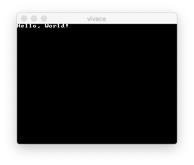

# crystal-allegro

Crystal binding of Allegro 5.x game library.

Because Allegro is C library, no extra process exists other than
building a regular Crystal app.

## Installation

1. Install development files (header files, pkg-config files, and
   libraries) of Allegro 5.
2. Add the dependency to your `shard.yml`:
   ```yaml
   dependencies:
     allegro:
       github: lugia-kun/crystal-allegro
   ```
3. Run `shards install`

We are using GCC or Clang (or any compiler supports `-dM` option which
lists defined macros instead of compile) to obtain specific values of
macros defined by Allegro library. The compiler to be used for this
can be changed using the enviroment variable `CRYSTAL_ALLEGRO_CC`.

## Usage

### Basic Example

```crystal
require "allegro"

Allegro.initialize
Allegro::Keyboard.initialize

timer = Allegro::Timer.for(1.0 / 30.0)
display = Allegro::Display.new(320, 240)
font = Allegro::Font.builtin_font

queue = Allegro::EventQueue.new
queue.register_keyboard_events
queue.register(display)
queue.register(timer)

timer.start
redraw = false
loop do
  event = queue.wait_for_event
  case event
  when Allegro::KeyDownEvent, Allegro::DisplayCloseEvent
    break
  when Allegro::TimerEvent
    redraw = true
  end
  if redraw && queue.is_empty?
    Allegro::Display.clear_to_color(Allegro::Color.new(0, 0, 0))
    font.draw("Hello, World!", Allegro::Color.new(255, 255, 255), 0, 0, 0)
    Allegro::Display.flip
    redraw = false
  end
end
```


## Development

TODO: Write development instructions here

## Contributing

1. Fork it (<https://github.com/lugia-kun/crystal-allegro/fork>)
2. Create your feature branch (`git checkout -b my-new-feature`)
3. Commit your changes (`git commit -am 'Add some feature'`)
4. Push to the branch (`git push origin my-new-feature`)
5. Create a new Pull Request

## Contributors

- [Hajime Yoshimori](https://github.com/lugia-kun]) - creator and maintainer
